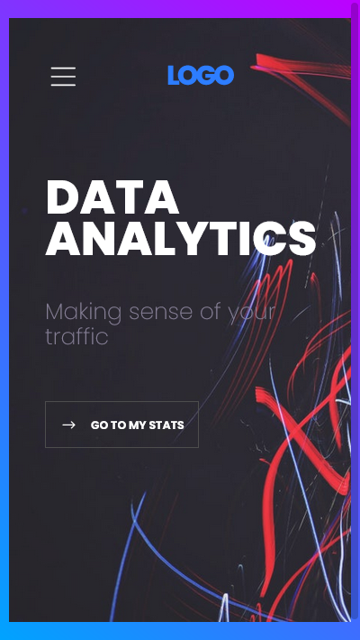
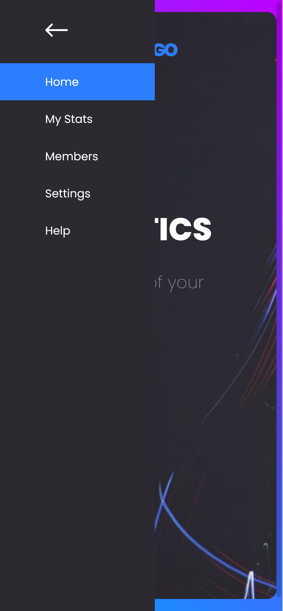
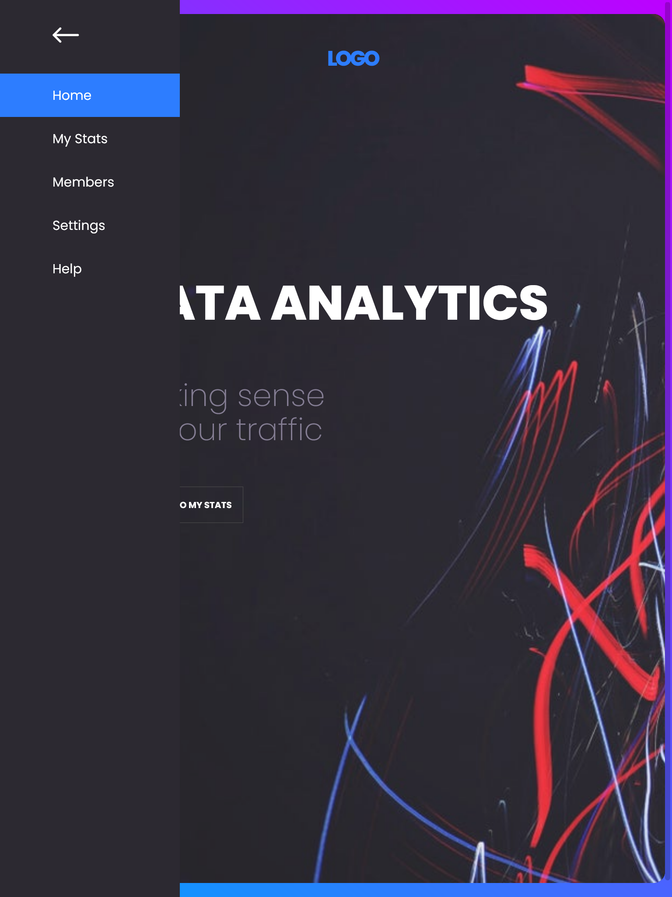

# figma-to-code-project3

## Overview
This is a responsive landing page with a side navigation as found in [Gary Simon's 'From Figma to Code' course](https://scrimba.com/learn/figmatocode). This page features a toggable side navigation (when in mobile or tablet) and some subtle hover effects and transitions.

### Phone
 

### Tablet
 

### Desktop

